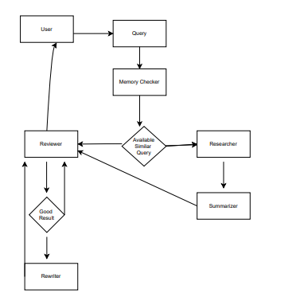
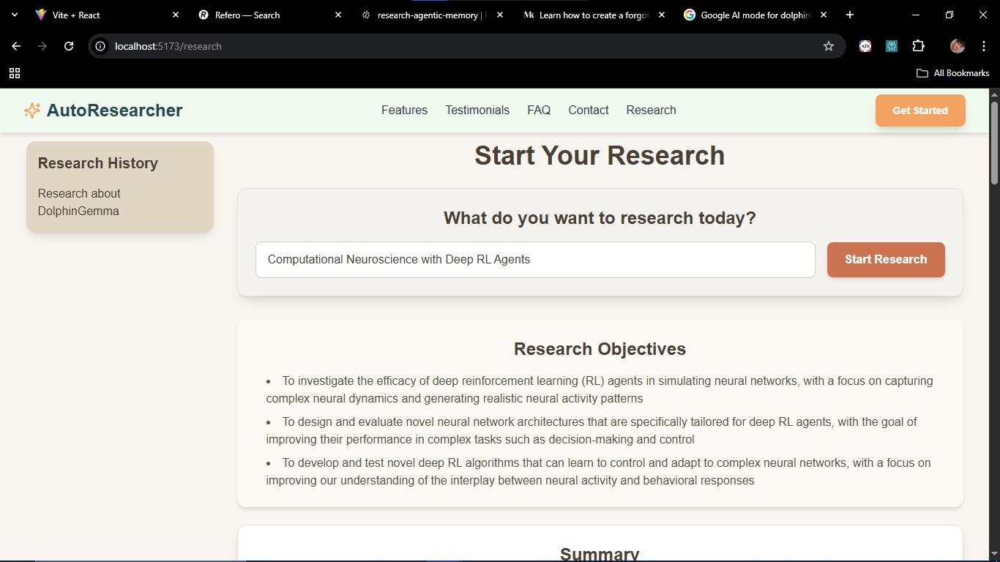
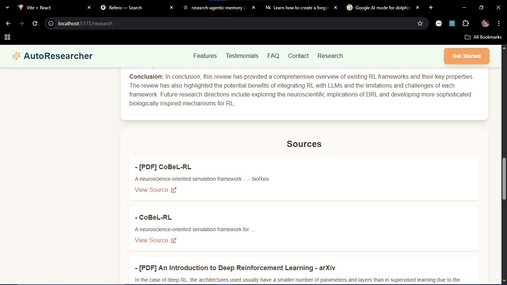

# 🧠 AutoResearcher

AutoResearcher is an intelligent, agentic AI system that performs **automated topic research**. You give it a research query or topic, and it plans, searches, summarizes, critiques, and reflects using multiple autonomous agents. It then returns a high-quality final report with sources.

---

## 📌 Key Features

- ✍️ Topic-based research planning  
- 🌐 Web research using Tavily API  
- 🧠 Hybrid memory (MongoDB + Pinecone) for contextual reuse  
- 📄 Summarization with chunking and merging  
- 🔁 Self-reflection and review-based improvement  
- 📲 Fullstack app with React + Node.js + FastAPI  
- 📚 Modular LangGraph architecture for agents  

---

## 🧰 Tech Stack

| Layer         | Technology                      |
|--------------|----------------------------------|
| Frontend     | React.js, TailwindCSS, Vite      |
| Backend (API)| Node.js (middleware)             |
| LLM Layer    | Python (FastAPI + LangGraph)     |
| Memory       | MongoDB (long-term) + Pinecone   |
| Web Search   | Tavily API                       |
| LLM Provider | Groq (LLaMA3 8B)                 |

---

## 🚀 Architecture Overview



---

## ⚡ Getting Started

### 1️⃣ Clone the repository
```bash
git clone https://github.com/your-username/AutoResearcher.git
cd AutoResearcher

Install dependencies
Backend (FastAPI + LangGraph)
cd backend
pip install -r requirements.txt

Frontend (React + Vite)
cd frontend
npm install

3️⃣ Setup environment variables

Create a .env file in both backend and frontend with required keys:

MONGO_URI=your_mongodb_connection
PINECONE_API_KEY=your_pinecone_key
TAVILY_API_KEY=your_tavily_key
GROQ_API_KEY=your_groq_key

4️⃣ Run the servers
Start backend (FastAPI)
cd backend
uvicorn app.main:app --reload

Start frontend (React)
cd frontend
npm run dev

5️⃣ Usage

Once running, open http://localhost:5173
 in your browser.
Enter a research query → AutoResearcher will plan, search, summarize, critique, and generate a final research report with sources.


--
🧪 Example
# Example Query:
"Computation Neuroscience with Deep RL Agents"



AutoResearcher will generate a structured research report with citations.


